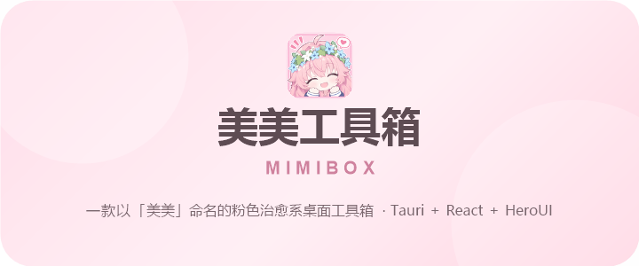

<!-- 美美工具箱 README — 粉色治愈系主题（横幅为图片：GitHub 不支持在 Markdown/HTML 中使用内联 CSS 上色） -->

<p align="center">
  
</p>

> 💡 「美美」是《与你相恋到生命尽头》中一名粉色可爱小女孩。

---

## ✨ 特性

<div align="center">
  <table>
    <tr>
      <td align="center" width="25%">
        <div style="font-size: 2rem; margin-bottom: 6px;">🎀</div>
        <strong style="color: #66535a;">粉色治愈系 UI</strong>
        <p style="margin: 4px 0 0; color: #9b8a91; font-size: 0.85rem;">温暖柔和的粉色主题<br />精致毛玻璃效果</p>
      </td>
      <td align="center" width="25%">
        <div style="font-size: 2rem; margin-bottom: 6px;">🖥️</div>
        <strong style="color: #66535a;">跨平台桌面应用</strong>
        <p style="margin: 4px 0 0; color: #9b8a91; font-size: 0.85rem;">基于 Tauri 2<br />支持 Windows / macOS / Linux</p>
      </td>
      <td align="center" width="25%">
        <div style="font-size: 2rem; margin-bottom: 6px;">⚡</div>
        <strong style="color: #66535a;">轻量高性能</strong>
        <p style="margin: 4px 0 0; color: #9b8a91; font-size: 0.85rem;">Rust 后端驱动<br />体积极小，启动飞快</p>
      </td>
      <td align="center" width="25%">
        <div style="font-size: 2rem; margin-bottom: 6px;">🧩</div>
        <strong style="color: #66535a;">模块化设计</strong>
        <p style="margin: 4px 0 0; color: #9b8a91; font-size: 0.85rem;">基于文件路由<br />易于扩展新功能</p>
      </td>
      <td align="center" width="25%">
        <div style="font-size: 2rem; margin-bottom: 6px;">🔐</div>
        <strong style="color: #66535a;">多平台多账号</strong>
        <p style="margin: 4px 0 0; color: #9b8a91; font-size: 0.85rem;">Bilibili 扫码/短信登录<br />抖音扫码 + 短信二次验证</p>
      </td>
    </tr>
  </table>
</div>

---

## 🛠️ 技术栈

| 层级 | 技术 |
| :--- | :--- |
| 前端框架 | React 19 + TypeScript |
| 构建工具 | Vite |
| UI 组件库 | HeroUI React v3 |
| 样式方案 | Tailwind CSS v4 |
| 路由 | TanStack React Router |
| 桌面框架 | Tauri 2 |
| 后端语言 | Rust |
| 包管理器 | pnpm |

---

## 📁 项目结构

```
MimiBox/
├── src/                     # 前端源代码
│   ├── assets/              # 静态资源（图标、背景图）
│   ├── components/          # React 组件
│   │   ├── CornerDock.tsx   # 左下角悬浮操作坞
│   │   ├── ErrorFallback.tsx # 错误降级界面
│   │   ├── TitleBar.tsx     # 无边框窗口标题栏
│   │   └── screen/          # 欢迎页、闲置屏保与空状态
│   ├── routes/              # 页面路由（文件路由）
│   │   ├── __root.tsx       # 根布局
│   │   ├── home.tsx         # 功能搜索与入口主页
│   │   ├── account.tsx      # 多平台账号登录与管理
│   │   ├── feature/         # 功能内容面板及子路由
│   │   ├── settings.tsx     # 设置页
│   │   ├── about.tsx        # 关于页
│   │   ├── feedback.tsx     # 反馈页
│   │   └── index.tsx        # 欢迎入口
│   ├── main.tsx             # 应用入口
│   ├── router.tsx           # 路由配置
│   └── style/               # 页面与组件样式
├── src-tauri/               # Tauri Rust 后端
│   ├── src/                 # Rust 源代码
│   │   ├── account.rs       # 多账号、Cookie、状态与网页登录命令
│   │   ├── douyin_web.rs    # 抖音 web 扫码登录（安全栈 + 短信 MFA）
│   │   ├── douyin_signer.rs # 抖音 bdms a_bogus 签名 + DTrait 指纹（QuickJS）
│   │   ├── lib.rs           # Tauri 应用初始化与命令注册
│   │   └── main.rs          # 桌面应用入口
│   ├── resources/           # 内嵌资源（抖音 JS SDK、协议参数）
│   ├── capabilities/        # Tauri 权限声明
│   ├── icons/               # 应用图标（多平台）
│   ├── Cargo.toml           # Rust 依赖配置
│   └── tauri.conf.json      # Tauri 配置
├── package.json             # 前端依赖
├── tsconfig.json            # TypeScript 配置
└── vite.config.ts           # Vite 配置
```

---

## 🚀 快速开始

### 环境要求

- [Node.js](https://nodejs.org/) >= 20.19（推荐使用 22.x LTS，Vite 8 要求）
- [pnpm](https://pnpm.io/) >= 9（项目锁定版本为 12，见 `package.json` 的 `packageManager`）
- [Rust](https://www.rust-lang.org/tools/install)（Tauri 编译依赖）
- 对应平台的编译工具链（Windows 需要 Visual Studio Build Tools）

### 安装依赖

```bash
pnpm install
```

### 开发模式

```bash
pnpm tauri dev
```

首次运行会下载 Rust 依赖并编译，需要耐心等待。后续启动会快很多。

### 构建生产版本

```bash
pnpm tauri build
```

构建产物会输出到 `src-tauri/target/release/` 目录。

### 仅前端开发

如果只需要调试前端界面，可以运行：

```bash
pnpm dev
```

然后在浏览器中访问 `http://localhost:1420`。

### 账号登录说明

账号页支持 Bilibili 与抖音两个平台。登录成功后，应用会将多账号所需的 Cookie 凭据保存在 Tauri 应用数据目录的 `accounts.json`，并在下次启动时恢复当前账号。每次进入账号页，Rust 后端都会重新检查各账号的登录状态；头像状态点分别表示凭证有效、已过期或网络异常。头像由后端代理为内嵌图片，避免图片 CDN 的防盗链影响显示。

右键点击当前账号头像可以退出登录，或在独立的网页窗口中打开当前账号。网页登录凭证由 Rust 直接写入隔离的 WebView Cookie Store，不会拼接到 URL，也不会返回给前端脚本。不同账号使用独立的 WebView 配置目录，避免登录状态互相覆盖。

**Bilibili**：支持扫码登录、短信登录和账号密码登录。短信与密码登录会在应用页面内加载 Bilibili Geetest 人机验证，完成验证后才能发送短信或提交登录。

**抖音**：支持扫码登录。后端通过 QuickJS 承载官方 bdms 1.0.1.20 与 dtrait 1.0.29 JavaScript SDK 生成 a_bogus 签名与设备指纹安全头，完成 web 协议握手与轮询。若账号触发 2046 短信二次验证，后端自动发送验证码并暂停轮询，前端弹出验证卡片供用户输入 6 位验证码；验证通过后自动续跑轮询完成登录。对于未开启手机短信验证的账号（如仅人脸验证），前端会显示引导提示，指引用户前往抖音 App 完成验证后重新扫码。

登录功能依赖网络连接，并受各平台的风控、验证码和服务条款约束。应用不会绕过人机验证。

### 闲置屏保

应用在长时间无操作后会进入日期与时间屏保。点击任意位置或按下任意按键即可返回，不影响当前页面状态。

---

## 📜 可用脚本

| 命令 | 说明 |
| :--- | :--- |
| `pnpm dev` | 启动 Vite 开发服务器 |
| `pnpm build` | 构建前端生产版本 |
| `pnpm preview` | 预览前端构建结果 |
| `pnpm tauri dev` | 启动 Tauri 开发模式（含热更新） |
| `pnpm tauri build` | 构建桌面应用安装包 |

---

## 🎨 设计规范

**主色调**

| 颜色 | 色值 | 用途 |
| :--- | :--- | :--- |
| 主粉色 | `#f5b3c9` | 按钮、强调色 |
| 浅粉色 | `#f6e3e1` | 背景、次要元素 |
| 渐变粉 | `#ffdde9` | 渐变、装饰 |

**文字颜色**

| 层级 | 色值 |
| :--- | :--- |
| 标题 | `#66535a` |
| 正文 | `#7b686f` |
| 辅助 | `#9b8a91` |

**视觉风格**

- 圆角：大圆角设计，按钮使用胶囊形状 (`999px`)
- 阴影：柔和的粉色投影
- 毛玻璃：`backdrop-filter: blur(12px) saturate(1.4)`

---

## 🤝 贡献

欢迎提交 Issue 和 Pull Request！

---

## 📚 参考

本项目在开发过程中参考了以下开源项目：

- [jumpbyte-bot](https://github.com/sisi0318/jumpbyte-bot)
- [douyin-web-qr-login](https://github.com/Caviar9/douyin-web-qr-login)
- [bpi-rs](https://github.com/Yuelioi/bpi-rs)

---

## ⚠️ 免责声明（宇宙免责协议）

> 本项目仅供学习、研究与技术交流，严禁用于任何商业、违法或滥用场景。
>
> 请勿用于窥探、骚扰、爬取或侵犯任何第三方。
>
> 一经下载 / 编译 / 运行本项目，即视为你已完全知悉并同意：由此产生的一切后果统统由你自己承担，与作者、贡献者、GitHub 及一切相关方无关。
>
> 本项目与任何平台 / 公司没有任何关联，非官方、未获授权、不代表其立场，所有商标归各自所有者。
>
> 请自行遵守你所在地的法律法规以及相关平台的服务条款；因违反而产生的任何责任由使用者独自承担。
>
> 依据 GPLv3，本软件按「原样」提供，不附带任何明示或暗示的担保（包括适销性、特定用途适用性、不侵权等）。
>
> 作者可能随时删库跑路，本声明拥有横跨三次元的最终解释权。不接受即刻删除，接受请继续。
>
> —— 声明参考：思思姐姐

---

<p align="center">
  
</p>
